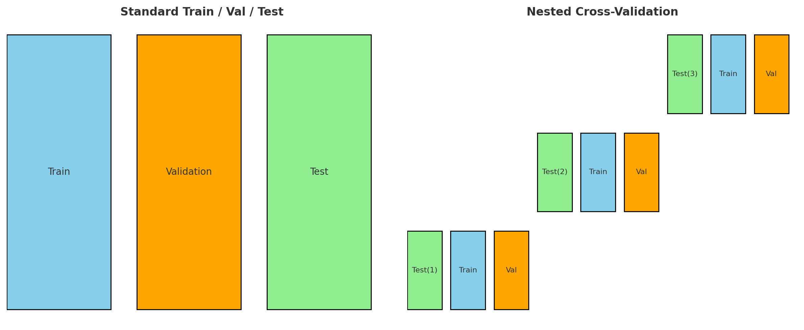

# Learning Best Practices for Model Evaluation and Hyperparameter Tuning

In this chapter we learn how to:

1. Assess the performance of machine learning models
2. Diagnose the common problems of machine learning algorithms
3. Fine-tune machine learning models
4. Evaluate predictive models using different performance metrics

## Streamline workflows with pipelines

We can use the `Pipeline Class` from scikit-learn which allows us to fit a model including any arbitrary number of transformation steps and apply it to make predictions about new data

## Using k-fold cross-validation to assess model performance

Cross-validation is used to help obtain reliable estimates of the model's generalization performance

### 1. Holdout Cross-Validation

In the `holdout method` we split the initial dataset into separate training and test datasets--however, we are also interested in tuning and comparing differnt parameter settings (`hyperparameters`). This process is called `model selection`.

If we reuse the same test dataset over and over again during model selection, it will become part of our training data and thus the model will be more likely to overfit. Many people still use the test dataset for `model selection` which is not a good machine learning practice.

> NOTE: This is very important to understand. Any time we are performing `model selection` by fine-tuning hyperparameters--if we use the `test dataset` to check the current model's accuracy and then update hyperparameters based on the results on the test data--we are effectively `leaking` the test data into the training process. We should therefore ssplit the data into a third portion (training/validation/test) so that the test dataset is truly unseen and only used 1 time when the hyperparameters have been locked (optimized based on the validation set). If we go back and tune the model after seeing poor results on the test dataset, we have corrupted the model again.

- `training data` - used to fit the different models

- `validation data` - used to evaluate model performance and tune hyperparameters (`model selection`)

- `test data` - used to estimate the model's ability to generalize to unseen data

A **DISADVANTAGE** of the holdout method is that the performance estimate may be very sensitive to **_HOW_** we partition the training dataset into the `training` and `validation` subsets.

### 2. K-fold Cross-Validation

In `k-fold cross-validation` we **RANDOMLY** split the `training dataset` into k folds without replacement. Here, k-1 folds (`training folds`), are used for the model training and 1 fold (`test fold`), is used for performance evaluation. This is repeated k times so that we obtain k models and performance estimates.

> NOTE: Reminder--`random selection without replacement`--you **NEVER** pick the same example twice in the same draw, once an item is chosen, it is removed from the "pool". E.g. drawing 5 cards from a deck of 52

> NOTE: Reminder--`random selection with replacement`--after you pick an example, you put it `back into` the pool before the next draw. The same example **CAN BE** picked multiple times. E.g. rolling a die 10 times

We calculate the `average performance` of the models based on the different, independent test folds to obtain a performance estimate that is `less sensitive` to the sub-partitioning of the training data (compared to `holdout method`).

#### Steps in k-fold cross-validation

Train/holdout split -> CV on training set

1. Split data into a large training set and a final untouched holdout set (test)
2. Use k-fold CV **only on the training set** to pick the best hyperparameters
3. Retrain with the best hyperparameters on **ALL** training data
4. Evaluate model **ONCE** on the untouched holdout data (test)

The advantage is that in each iteration, each example will be used exactly once and the training and test folds are dijoint (no overlap)

A good standard value of k in k-fold CV is 10. But when working with relatively small training sets (increase the number of folds).

Increasing the number of folds (k), increases the training data that will be used in each iteration.

Increasing the number of folds (k), increases the runtime of cross-validation and yield estimates with higher variance(overfit) since each fold will be more similar to each other.

A slight improvement can be made using the `stratified k-fold cross-validation` technique

## Debugging algorithms with learning and validation curves

Two diagnostic tools that help improve the performance of a learning algorithm:

1. Learning Curves (vary data size - keep model fixed)

   - X-axis: training set size (fraction or number of examples)
   - Y-axis: model performance (train score & CV validation score)
   - Purpose: show how MORE DATA affects bias/variance and where performance plateaus

2. Validation Curves (vary hyperparameter - keep data size fixed)
   - X-axis: single hyperparameter value (C in SVM, tree depth, learning rate, etc)
   - Y-axis: model performance (train score & CV validation score)
   - Purpose: show how tuning that hyperparameter affects over/underfitting

### Diagnosing bias and variance problems with Learning Curves

Plotting model training accuracy and validation accuracy as functions of the training dataset size--we can detect whether the model suffers from high variance (overfitting) or high bias (underfitting)

## Addressing over- and under-fitting with validation curves

Validation curves are related to learning curves, but instead of plotting the training and test accuracies as functions of the sample size, we vary the `values` of the model `parameters` (e.g. - inverse regularization parameter C)

## Fine-tuning machine learning models via grid-search

There are two types of parameters:

1. Those learned from the training data (e.g. model weights in logistic regression)
2. Parameters of a learning algorithm that are optimized separately (`tuning parameters`--e.g. inverse regularization parameter)

`grid search` - helps to improve the performance of a model by finding the `optimal combination of hyperparameter values`

> NOTE: It is a brute-force exhaustive search paradigm

We specify the list of values for different hyperparameters, and the computer evaluates the model performance for each combination

## Exploring hyperparameter configurations with Random Search

In `randomized search` we draw hyperparameter configurations randomly from distributions. In contrast to grid search, randomized search does **NOT** do an exhautive search over the hyperparameter space--still it allows us to explore a wider range of hyperparameter values settings in a more cost- and time-effective manner.

## Resource-efficient hyperparameter search with Successive Halving

scikit-learn's `HalvingRandomSearchCV` makes finding suitable hyperparameter configurations more efficient

`Successive halving` - successively throws out unpromising hyperparameter configurations until only one configuration remains

#### Steps to Successive Halving

1. Draw a large set of candidate configurations via random sampling
2. Train the models with limited resources, for example, a small subset of the training data (as opposed to entire training set
3. Discard the bottom 50 percent based on predictive performance
4. Go back to step 2 with an increased amount of available resources

## Algorithm selection with nested cross-validation

`Nested cross-validation` is the recommended approach to select among different machin learning algorithms

In `nested cross-validation`, we have an outer k-fold cross-validation loop to split the data into training and test folds, and an inner loop is used to select the model using k-fold cross-validation on the training fold.

After model selection, the test fold is then used to evaluate the model performance.

We can perform nested cross-validation in scikit-learn with grid search

## Looking at differnt performance evaluation metrics

We have previously only been looking at `prediction accuracy` as the metric to evaluate a model's performance. However, there are several others:

- precision
- recall
- F1 score
- Matthews Correlation Coefficient (MCC)

### Confusion Matrix

A `confusion matrix` is a square matrix that reports the counts of the `true positive (TP)`, `true negative (TN)`, `false positive (FP)` and `false negative (FN)` prediction of a classifier

### Errror & Accuracy

$$
{ERR} = \frac{FP+FN}{FP+FN+TP+TN}
$$

$$
{ACC} = 1 - ERR
$$

### False Positive Rate (FPR) & False Negative Rate (FNR)

$$
{FPR} = \frac{FP}{N} = \frac{FP}{FP + TN}
$$

$$
{TPR} = \frac{TP}{P} = \frac{TP}{FN + TP}
$$

### Precision (PRE) and Recall (REC)

Precision - fraction of true positives in identified positives (1 == perfect prediction | < 1 == false positives exist). Of all things predicted as positive, how many were actually positive

$$
{PRE} = \frac{TP}{TP+FP}
$$

Recall - fraction of correctly predicted true positives. (1 == perfect prediction | < 1 == some false values predictedas true. How good is the model at finding all the 'positive' cases

$$
{REC} = \frac{TP}{FN+TP}
$$

Ex: With tumor dataset--optimizing for recall helps with minimizing the chance of NOT DETECTING a malignant tumor. This comes at cost of predicting "malignant" tumor in patients with "benign" tumors.

Tradeoff - improving recall leads to higher false positives (patient told they have cancer when they don't), improving precision leads to higher false negatives (patient told they don't have cancer when they do)

Optimize recall = higher false positives
Optimize precision = higher false negatives

### F1 Score

The F1 score aims to balance the precision-recall tradeoff

$$
{F1} = 2\frac{PRE \times REC}{PRE + REC}
$$
