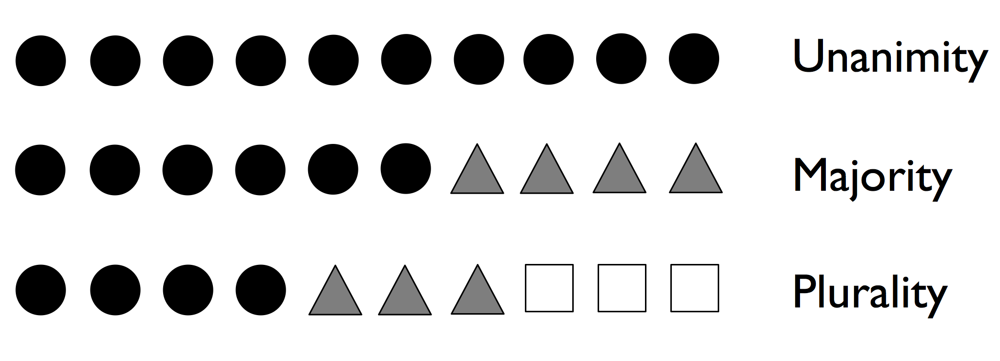
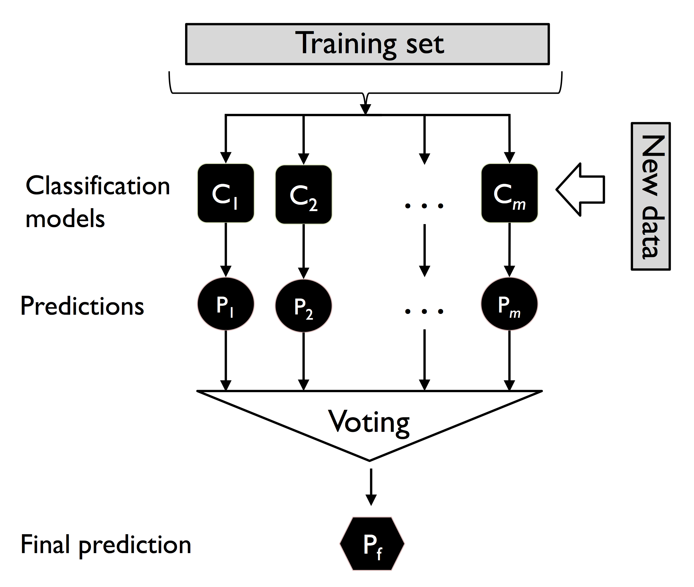

# Combining Different Models for Ensemble Learning

## Learning with ensembles

The goal of building ensemble models is to construct a set of classifiers that have a better predictive performance than any of the individual models

- Make predictions based on `majority voting`
- Use `bagging` to reduce overfitting (drawing random combinations of the training dataset with repetition)
- Apply `boosting` to build powerful models from `weak learners` that learn from their mistakes

`majority voting` - we select the class label that has been predicted by the majority of classifiers (> 50% of votes)

> NOTE: majority voting (in strict terms) refers to `binary classification` but can be extended to multi-class classification sometimes known as `plurality voting`



> NOTE: Random Forest Classification is an example of building ensemble models

Depending on the technique, the ensemble can be built from:

1. Different classification algorithms (decision trees, SVMs, Logistic Regression, etc.) + Same Training Data
2. Different subsets of training data (nested k-fold CV) + Same Classifier



We combine the predicted class labels of each individual classifier and select the class label that received the most votes (argmax)

## Combining classifiers via majority vote

Example of predicting majority vote on un-weighted and weighted classifiers

```python
# unweighted majority vote
print("Majority Vote:", np.argmax(np.bincount([0, 0, 1])))
# weighted majorty vote
print(
    "C3 Weighted Majority Vote:",
    np.argmax(np.bincount([0, 0, 1], weights=[0.2, 0.2, 0.6])),
)
```

Remember using the `predict_proba_` method of some classifiers returns the class label predicted probabilities

Ex: 3 classfier ensemble model for binary classification (label 0 or 1)
Assumed classifier weights: wc1 = 0.2, wc2 = 0.2, wc3 = 0.6

The probabilities returned by the classifiers may be:
c1_0 = 0.9, c1_1 = 0.1, c2_0=0.8, c2_1 = 0.2, c3_0 = 0.4, c3_1=0.6

Therefore the weighted ensemble proabilities for class 0 and class 1 would be:

Class 0: $(0.2 * 0.9) + (0.2 * 0.8) + (0.6 * 0.4) = 0.58$
Class 1: $(0.2 * 0.1) + (0.2 * 0.2) + (0.6 * 0.6) = 0.42$

Argmax would then choose Class 0 (0.58)

### Implementing a simple majority vote classifier

See code

### Using the majority voting principle to make predictions

See code

### Evaluating and tuning the ensemble classifier

see code

## Bagging--building an ensemble of classifiers from bootstrap samples

`Bagging` (aka boostrap aggregating) - an ensemble learning technique closely related to `majority vote`

Instead of using the same training dataset to fit the individual classifiers in the ensemble, we draw `bootstrap samples` (random samples with replacement) - from the initial training dataset

### Bagging in a nutshell

1. Each classifier in the ensemble receives a random subset of the initial training dataset.
2. Fit each classifier to its sampled training data
3. Combine predictions from individual classifiers using majority voting

> NOTE: Random forests are a special case of bagging where we **ALSO** use random feature subsets when fitting the individual decision trees

### Applying bagging to classify examples in the Wine dataset

See code

## Leveraging weak learners via adaptive boosting

In `boosting` the ensemble consists of very simple base classifiers (aka `weak learners`), which often only have slight performance advantage over random guessing.

> NOTE: A typical example of a weak learner is a decision tree stump

The key concept is to focus on training examples that are `hard to classify`--e.g. let the weak learners subsequently learn from misclassified training examples to improve the performance of the ensemble.

### How adaptive boosting works

`AdaBoost` - uses the complete training dataset, where training examples are reweighted in each iteration to build a strong classifier that learns from the mistakes of the previous weak learners in the ensemble

1. Set the weight vector **w**, to uniform weights, where $\sum_{i}w_i = 1$
2. For _j_ in _m_ boosting rounds, do the following:
   - Train a weighted weak learner (Cj) = train(X, y, w)
   - Predict class labels (y_pred) = predict(Cj, X)
   - Compute the weighted error rate (eta) = $w \cdot (y_{pred} \neq y)$
   - Compute the coefficient alpha_j = $0.5 \log{\frac{1-\eta}{\eta}}$
   - Update the weights: w := $w \times \exp(-\alpha_j \times y_{pred} \times y)$
   - Normalize the weights to sum to 1: w := $\frac{w}{\sum_iw_i} $
3. Compute the final prediction: $\hat{y} = \left( \sum_{j=1}^m \alpha_j \, \text{predict}(C_j, X) > 0 \right)$

### Applying AdaBoost using scikit-learn

See Code

## Gradient boosting--training an ensemble based on loss gradients

`Gradient boosting` is a variant of the boosting concept--successfully training weak learners to create a strong learner

### Comparing AdaBoost with gradient boosting

`AdaBoost` - trains decision tree stumps based on errors of the previous decision tree stump

`Gradient Boosting`- fits decision trees in an iterative fashion using prediction errors. Gradient boosting trees are deeper than decision tree stumps and typically have a maximum depth of `3 to 6` (or a maximum number of `8 to 64 leaf nodes`)

Gradient boosting does not use the prediction errors for assigning sample weights--they are used directly to form the target variable for fitting the next tree. Also, instead of having an individual weighting term for each tree, gradient boosting uses a global learning rate that is the same for each tree.

### Outlining the general gradient boosting algorithm

- Gradient boosting builds a series of trees, where each tree is fit on the error--the difference between the label and the prediction of the previous tree.

- In each round, the tree ensemble improves as we are nudging each tree more in the right direction via small updates

- Updates are based on a loss gradient

1. Initialize a model to return a constant prediction value (use a decision tree root node--single leaf)
   We denote the value returned by the tree as y_hat and find this value by minimizing a differentiable loss function

2. For each tree (m) = 1, ... , M -- where M is user-specified total number of trees, we carry out the following:
   - Compute the difference between a predicted value and the class label (error) sometimes referred to as `pseudo-residual` and is written as the negative gradient of the loss function (VERY VERY SIMILAR TO MODEL TRAINING)
   - Fit a tree to the pseudo-residuals
   - For each leaf node (R*jm), we compute the following output value: $gamma*{jm} = argmin \sum{L(y*i, F*{m-1}(x_i)+ \gamma)$
   - Update the model by adding the output values $\gamma_m$ to the previous tree

### Explaining the gradient boosting algorithm for classification

Explaining Gradient Boosting applied to Binary Classification:

1. Create a root node that minimizes the logistic loss.

   - Returns the log(odds), $\hat{y}$

2. For each tree m = 1, ..., M, carry out the following:

- convert log(odds) into a probability using the logistic function (same as logistic regression)

$$
p = \frac{1}{1+e^{-\hat{y}}}
$$

- compute the pseudo-residual which is the negative partial derivative of the loss wrt the log(odds)

$$
-\frac{\partial L_i}{\partial \hat{y}_i} = y_i - p_i
$$

- Fit a new tree to the pseudo-residuals

- For each leaf node $R_{jm}$, compute a value $\gamma_{jm}$ that minimizes the logistic loss function

$$
\gamma_{jm} = \arg\min_{\gamma} \sum L(y_i, F_{m-1}(x_i)+\gamma) = \log(1 + e^{\hat{y_i}+\gamma})-y_i(\hat{y}_i+\gamma)
$$

$$
\gamma_{jm} = \frac{\sum_i(y_i - p_i)}{\sum_i(p_i(i-p_i))}
$$

Note that the summation here is only over the examples at the leaf node, **NOT** the complete training set

- update the model by adding the gamma value with the learning rate $\eta$

$$
F_m(x) = F_{m-1}(x) + \eta\gamma_m
$$

### Illustrating gradient boosting for classification

See Code

### Using XGBoost

See Code

## Additional Resources:

- XGBoost: "https://xgboost.readthedocs.io/en/stable/"
- LightGBM: "https://lightgbm.readthedocs.io/en/lates/"
- CatBoost: "https://catboost.ai"
- HistGradientBoostingClassifier: "https://scikit-learn.org/stable/modules/generated/sklearn.ensemble.HistGradientBoostingClassifier.html"
